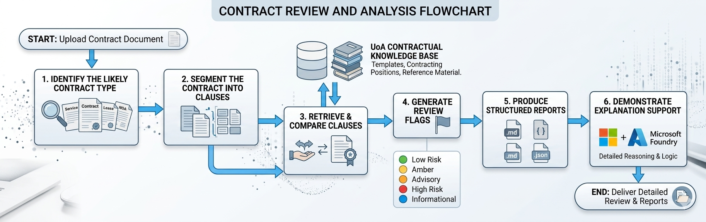
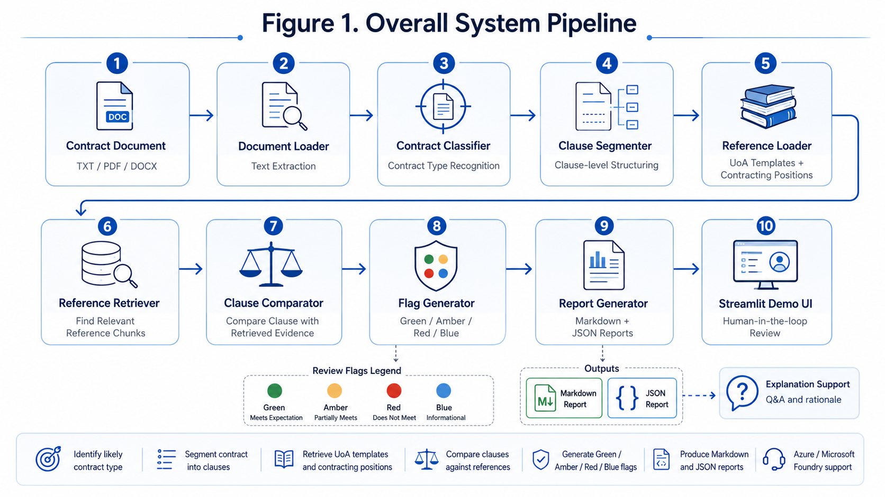
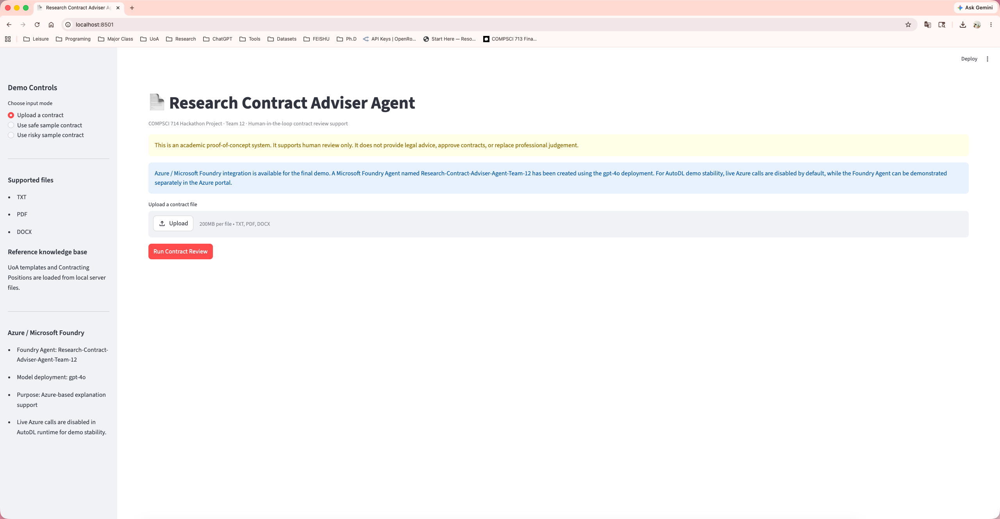
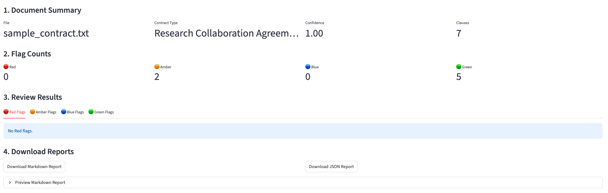
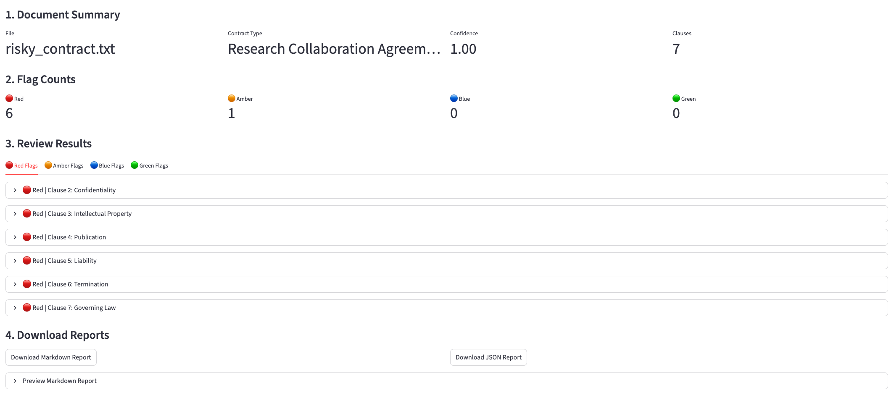
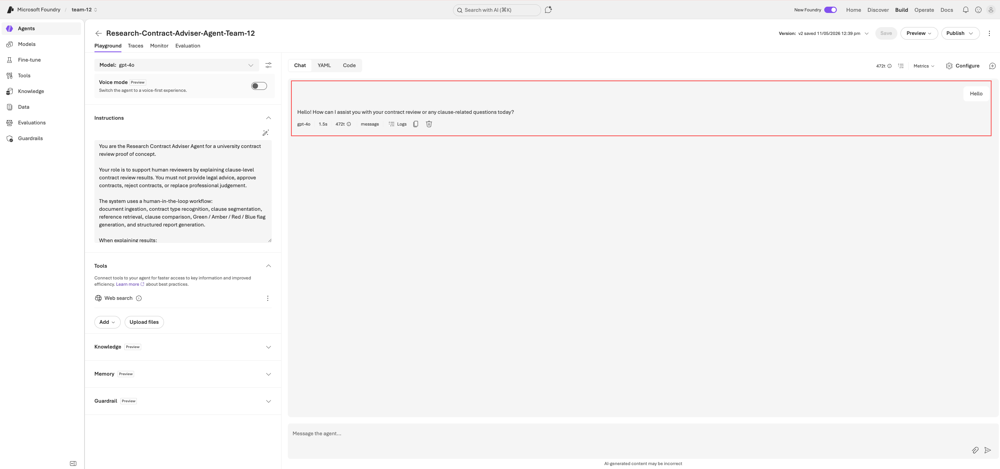
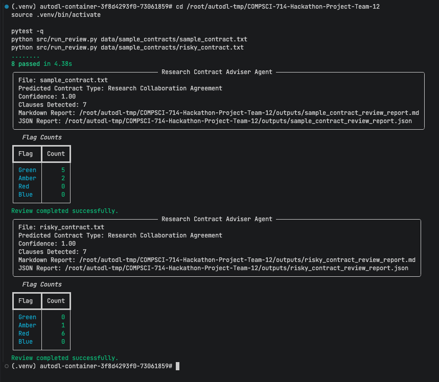

# Checkpoint 2 - Research Contract Adviser Agent  
# 检查点 2 - 研究合同顾问智能体

## Team 12 - NovaMind Collective  
## COMPSCI 714 - AI Architecture and Design

---

## 1. Project Overview / 项目概述

### English

Our team is developing a proof-of-concept **Research Contract Adviser Agent** to support university staff in reviewing externally drafted research contracts.

The system helps human reviewers:

- identify the likely contract type;
- segment the contract into clauses;
- retrieve relevant UoA templates and contracting positions;
- compare uploaded clauses against reference materials;
- generate Green / Amber / Red / Blue review flags;
- produce structured Markdown and JSON reports;
- demonstrate Azure / Microsoft Foundry explanation support.

The system is designed as a **human-in-the-loop decision-support tool**. It does not provide legal advice, approve contracts, reject contracts, or replace professional legal judgement.

### 中文

我们团队正在开发一个概念验证系统：**Research Contract Adviser Agent（研究合同顾问智能体）**，用于辅助大学工作人员审查外部合作方提供的研究合同。

该系统可以帮助人工审查者：

- 识别上传合同的可能类型；
- 将合同切分为条款；
- 检索相关的 UoA 合同模板和 contracting positions；
- 将上传条款与参考资料进行比较；
- 生成 Green / Amber / Red / Blue 四类审查标记；
- 输出 Markdown 和 JSON 结构化报告；
- 展示 Azure / Microsoft Foundry 的解释支持能力。

本系统被设计为 **human-in-the-loop（人在回路中）决策支持工具**，不提供法律建议，不批准或拒绝合同，也不替代专业法律判断。

---

## 2. Problem Understanding / 问题理解

### English

Research contracts often contain complex clauses related to confidentiality, intellectual property, publication rights, liability, termination, data use, payment, and governing law. Manually checking these clauses against institutional templates and contracting positions can be repetitive, time-consuming, and inconsistent.

Therefore, this use case is not simply a chatbot task. It is a **document intelligence and review-support task** that requires grounded retrieval, clause-level comparison, transparent flagging, and human oversight.

### 中文

研究合同通常包含复杂条款，例如 confidentiality（保密）、intellectual property（知识产权）、publication rights（发表权）、liability（责任）、termination（终止）、data use（数据使用）、payment（付款）以及 governing law（适用法律）。人工逐条对照学校模板和标准立场进行审查，往往耗时、重复，并且容易不一致。

因此，这个 use case 不是简单的聊天机器人任务，而是一个 **文档智能 + 审查支持任务**。它需要基于参考资料的检索、条款级比较、透明的风险标记以及人工监督。

---

## 3. System Architecture / 系统架构

### English

The current MVP follows a modular retrieval-guided architecture. The deterministic local pipeline is responsible for document processing, retrieval, comparison, and flag assignment. Azure / Microsoft Foundry is used as an explanation support layer rather than an autonomous legal decision-maker.

### 中文

当前 MVP 采用模块化、检索增强式架构。本地 deterministic pipeline（确定性流程）负责文档处理、参考资料检索、条款比较和 flag 判断。Azure / Microsoft Foundry 用于解释支持，而不是作为自动法律决策系统。

### Figure 1. Overall System Pipeline  
### 图 1：系统整体流程图



```text
Contract Document
TXT / PDF / DOCX
        ↓
Document Loader
Text Extraction
        ↓
Contract Classifier
Contract Type Recognition
        ↓
Clause Segmenter
Clause-level Structuring
        ↓
Reference Loader
UoA Templates + Contracting Positions
        ↓
Reference Retriever
Find Relevant Reference Chunks
        ↓
Clause Comparator
Compare Clause with Retrieved Evidence
        ↓
Flag Generator
Green / Amber / Red / Blue
        ↓
Report Generator
Markdown + JSON Reports
        ↓
Streamlit Demo UI
Human-in-the-loop Review
```

---

## 4. Implemented Components / 已实现模块

### Table 1. Implementation Progress  
### 表 1：当前实现进度

| Component / 模块 | File / 文件 | Function / 功能 | Status / 状态 |
|---|---|---|---|
| Document Loader | `src/ingest/document_loader.py` | Loads TXT, PDF, and DOCX files and extracts text. / 读取 TXT、PDF、DOCX 并提取文本。 | Completed |
| Contract Classifier | `src/classify/contract_classifier.py` | Predicts the likely contract type. / 识别合同类型。 | Completed |
| Clause Segmenter | `src/preprocess/clause_segmenter.py` | Splits contract text into structured clauses. / 将合同文本切分为结构化条款。 | Completed |
| Reference Loader | `src/retrieve/reference_loader.py` | Loads local UoA reference templates and positions. / 加载本地 UoA 模板和标准立场。 | Completed |
| Reference Retriever | `src/retrieve/retriever.py` | Retrieves relevant reference chunks. / 检索相关参考片段。 | Completed |
| Clause Comparator | `src/compare/clause_comparator.py` | Compares uploaded clauses with retrieved evidence. / 对比上传条款和检索证据。 | Completed |
| Report Generator | `src/report/report_generator.py` | Generates Markdown and JSON reports. / 生成 Markdown 和 JSON 报告。 | Completed |
| Review Pipeline | `src/pipeline/review_pipeline.py` | Centralises the full workflow. / 统一封装完整流程。 | Completed |
| Streamlit UI | `src/ui/app.py` | Provides web-based demo interface. / 提供网页演示界面。 | Completed |
| Azure Explainer | `src/azure/azure_explainer.py` | Provides Azure explanation support. / 提供 Azure 解释增强支持。 | Implemented |
| Tests | `tests/test_pipeline.py` | Validates the core pipeline. / 验证核心流程。 | Completed |

---

## 5. Streamlit Demo Interface / Streamlit 演示界面

### English

The Streamlit interface allows users to select a safe sample contract, select a risky sample contract, or upload a TXT, PDF, or DOCX contract file. After running the review, the interface displays document summary information, flag counts, clause-level review details, and downloadable reports.

### 中文

Streamlit 界面支持选择 safe sample、risky sample，或者上传 TXT、PDF、DOCX 合同文件。运行审查后，界面会显示文档摘要、flag 统计、条款级审查结果，并支持下载 Markdown / JSON 报告。

### Figure 2. Streamlit User Interface  
### 图 2：Streamlit 系统界面



---

## 6. Demo Results / 演示结果

### 6.1 Safe Sample Contract / 安全样例合同

### English

The safe sample contract represents a generally acceptable research collaboration agreement. The system identifies most clauses as Green and keeps uncertain clauses as Amber for human review.

### 中文

安全样例合同代表相对正常、可接受的研究合作协议。系统将大多数条款识别为 Green，并将需要进一步人工确认的条款标记为 Amber。

Input file / 输入文件：

```text
data/sample_contracts/sample_contract.txt
```

### Result / 结果

| Flag / 标记 | Count / 数量 |
|---|---:|
| Green | 5 |
| Amber | 2 |
| Blue | 0 |
| Red | 0 |

### Figure 3. Safe Sample Result  
### 图 3：安全样例结果



```text
Safe Sample Result
Green  █████ 5
Amber  ██    2
Blue         0
Red          0
```

---

### 6.2 Risky Sample Contract / 风险样例合同

### English

The risky sample contract deliberately contains high-risk wording. The system successfully identifies six Red Flags related to confidentiality, intellectual property assignment, publication restrictions, unlimited liability, termination restrictions, and non-New Zealand governing law.

### 中文

风险样例合同故意加入了高风险条款。系统成功识别出 6 个 Red Flags，涉及保密义务过宽、知识产权转让、发表限制、无限责任、终止权限制以及非新西兰适用法律等问题。

Input file / 输入文件：

```text
data/sample_contracts/risky_contract.txt
```

### Result / 结果

| Flag / 标记 | Count / 数量 |
|---|---:|
| Red | 6 |
| Amber | 1 |
| Blue | 0 |
| Green | 0 |

### Figure 4. Risky Sample Result  
### 图 4：风险样例结果



```text
Risky Sample Result
Red    ██████ 6
Amber  █      1
Blue          0
Green         0
```

---

## 7. Azure / Microsoft Foundry Integration  
## 7. Azure / Microsoft Foundry 集成

### English

A Microsoft Foundry Agent has been created for the project to demonstrate Azure-based explanation support.

The Azure Agent is not responsible for assigning or changing review flags. Instead, it explains clause-level review results in professional language and supports human reviewers.

### 中文

我们已经在 Microsoft Foundry 中创建了一个 Agent，用于展示 Azure 端的解释支持能力。

Azure Agent 不负责分配或修改 Green / Amber / Red / Blue 标记，而是用于以更专业的语言解释条款级审查结果，辅助人工审查。

### Azure Agent Information / Azure Agent 信息

| Item / 项目 | Details / 详情 |
|---|---|
| Agent name / Agent 名称 | `Research-Contract-Adviser-Agent-Team-12` |
| Model deployment / 模型部署 | `gpt-4o` |
| Purpose / 目的 | Clause-level explanation support / 条款级解释支持 |
| Decision role / 决策角色 | Does not assign flags / 不负责 flag 判断 |

### Figure 5. Microsoft Foundry Agent  
### 图 5：Microsoft Foundry Agent



### Azure Demo Prompt / Azure 演示 Prompt

```text
A confidentiality clause says the University must keep all confidential information secret forever and without exception. The local system assigned a Red flag. Explain why this requires human review.
```

### Expected Behaviour / 预期行为

The Agent should explain why the clause requires human review, while avoiding legal advice and avoiding final approval or rejection.

该 Agent 应该解释为什么该条款需要人工审查，但不能提供法律建议，也不能直接批准或拒绝合同。

---

## 8. Testing Results / 测试结果

### English

The automated test suite currently passes successfully.

### 中文

当前自动化测试已经成功通过。

```text
pytest -q
8 passed
```

The tests cover:

- document loading;
- clause segmentation;
- contract type classification;
- reference loading;
- reference retrieval;
- safe sample flag counts;
- risky sample red flag detection;
- Markdown / JSON report generation.

测试覆盖：

- 文档读取；
- 条款切分；
- 合同类型识别；
- 参考资料加载；
- 参考资料检索；
- safe sample flag 统计；
- risky sample red flag 检测；
- Markdown / JSON 报告生成。

### Figure 6. Test Output  
### 图 6：测试输出



---

## 9. Responsible AI and Human Oversight  
## 9. 负责任 AI 与人工监督

### English

The system follows a human-in-the-loop design. It supports human reviewers but does not make final legal decisions.

### 中文

本系统遵循 human-in-the-loop（人在回路中）设计。它辅助人工审查者，但不做最终法律决定。

### Safeguards / 保护措施

| Risk / 风险 | Mitigation / 缓解措施 |
|---|---|
| Confidential contract data exposure / 机密合同泄露 | Use anonymised or sample contracts only. Sensitive files are excluded from GitHub. / 仅使用匿名或样例合同，敏感文件不上传 GitHub。 |
| Over-reliance on AI output / 过度依赖 AI 输出 | All flags require human review. / 所有 flags 都需要人工审查。 |
| Unsupported legal conclusions / 无依据的法律结论 | The system provides rationale and retrieved evidence but does not make final decisions. / 系统提供解释和检索证据，但不做最终决定。 |
| Azure model uncertainty / Azure 模型不确定性 | Azure is used for explanation support only, not final flag assignment. / Azure 仅用于解释支持，不负责最终 flag 判断。 |
| Public repository leakage / 公共仓库泄露 | `.env`, private data, reference templates, and internal files are excluded through `.gitignore`. / `.env`、private data、reference templates 等通过 `.gitignore` 排除。 |

---

## 10. Current Limitations / 当前限制

### English

The MVP is functional but still has several limitations:

- clause segmentation is rule-based;
- reference retrieval is lexical and topic-based rather than production vector search;
- flag generation is rule-guided and cannot replace expert legal review;
- evaluation currently uses a small safe/risky sample set;
- live Azure calls from AutoDL are disabled by default for demo stability;
- the full Streamlit application has not been deployed to Azure App Service.

### 中文

当前 MVP 已经可运行，但仍存在一些限制：

- 条款切分仍然基于规则；
- 参考资料检索主要基于关键词和 topic，不是生产级向量检索；
- flag 生成基于规则，不能替代专家法律审查；
- 当前评估样本主要是 safe / risky 两个样例；
- 为了保证 AutoDL 演示稳定性，实时 Azure 调用默认关闭；
- 当前还没有将整个 Streamlit 应用部署到 Azure App Service。

---

## 11. Next Steps / 下一步计划

### English

The next stage will focus on:

- preparing final presentation slides;
- preparing the final report;
- improving evaluation with more benchmark contracts;
- refining the UI for a clearer demo;
- exploring Azure AI Search or vector retrieval;
- exploring more reliable Azure deployment options.

### 中文

下一阶段工作重点包括：

- 准备最终展示 PPT；
- 准备 Final Report；
- 使用更多 benchmark contracts 进行评估；
- 优化 UI 展示效果；
- 探索 Azure AI Search 或向量检索；
- 探索更稳定的 Azure 部署方案。

---

## 12. Summary / 总结

### English

At Checkpoint 2, our project has reached a working MVP stage. The system can load contract documents, classify contract type, segment clauses, retrieve relevant reference materials, compare clauses, generate Green / Amber / Red / Blue review flags, produce Markdown and JSON reports, and demonstrate the workflow through a Streamlit UI.

The project also includes a Microsoft Foundry Agent using the `gpt-4o` deployment to demonstrate Azure-based explanation support. The system remains human-in-the-loop, with local deterministic logic controlling review flags and Azure used only as an explanation support layer.

Overall, the project satisfies the core implementation goals of the selected **Research Contract Adviser Agent** use case and is ready for final presentation and reporting.

### 中文

截至 Checkpoint 2，我们的项目已经达到可运行 MVP 阶段。系统能够读取合同文档、识别合同类型、切分条款、检索相关参考资料、比较条款、生成 Green / Amber / Red / Blue 审查标记，并生成 Markdown / JSON 报告，同时可以通过 Streamlit UI 展示完整流程。

项目还包括一个使用 `gpt-4o` deployment 的 Microsoft Foundry Agent，用于展示 Azure 端的解释支持能力。系统仍然保持 human-in-the-loop 设计，由本地确定性逻辑控制 flag 判断，Azure 仅作为解释支持层。

总体来说，本项目已经满足所选 **Research Contract Adviser Agent** use case 的核心实现目标，可以进入最终展示和报告阶段。

---

## Suggested Figures / 图片插入建议

| Figure | Content | Suggested File Path |
|---|---|---|
| Figure 1 | System architecture diagram | `assets/fig1_system_pipeline.png` |
| Figure 2 | Streamlit homepage with Azure notice | `assets/fig2_streamlit_ui.png` |
| Figure 3 | Safe sample result | `assets/fig3_safe_sample_result.png` |
| Figure 4 | Risky sample result | `assets/fig4_risky_sample_result.png` |
| Figure 5 | Microsoft Foundry Agent page | `assets/fig5_foundry_agent.png` |
| Figure 6 | pytest and CLI output | `assets/fig6_test_output.png` |
